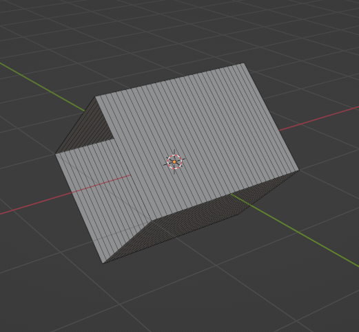

# Sling! #

## Summary ##

_Sling Fighter!_ is a slingshot-style arcade game where you launch into a dummy at full force! Compete for the best score in this no-holds-barred action brawl. Our game contains 15 waves and a local leaderboard system.

## Project Resources

[Itch page](https://slingfighter.itch.io/sling-fighter)
[Trailor](https://youtu.be/LsbTWjYsmSs)  
[Press Kit](https://slingfighter.itch.io/sling-fighter)  
[Proposal](https://docs.google.com/document/d/1C83mvbO1hN6x2nOqhr4wfracJC8zQ0X5KEP7wMynV6c/edit?usp=sharing)

## Gameplay Explanation ##

This game was designed for controller, but it will also work for keyboard and mouse. Use 'A' and the 'left stick' to pull back on the ropes, and let go to fire onto enemies. 'LB' and 'RB' are your sidesteps.

There's an Easter Egg Menu, where players will be able to test out and select all the different waves in our game upon "discovering" the Easter Egg Menu. [Players are able to trigger the button that will map them into the Easter Egg Menu Scene inside the Main Menu](https://drive.google.com/file/d/1MRuQmWAHXB4nzQJ3c6h2hkBnrZ8gLeAD/view?usp=sharing) Upon successfully triggering for 1.5 seconds. They'll be able to [interact with the Easter Egg Menu](https://drive.google.com/file/d/141eaEayj4F0xNze3OUZja2-lK-uOQjl5/view?usp=sharing). 

Read more on itch!

## Note on the Scoreboard and Itch
Our implementation of the scoreboard relies on SQLite and a local database file to keep track of the scores. Unfortunately, we cannot access the SQLite libraries from Unity WebGL. There are possible ways to fix this by changing our implementation, but we didn't have time to do so. For now, scores can only be tracked from a local Windows/Mac build, and not WebGL. Maybe in the future we can have an online leaderboard though!

# Main Roles #

## Producer - Lucas Wang

As the producer, my primary responsibility was to manage the direction of our game and make sure that everyone understood their roles. It was important for me to avoid taking over the project and making every decision. Instead, I saw it as my responsibility to facilitate a reliable communication channel within our group and serve as a knowledgeable source of information about the project.

In preparation for this project, I carefully read over the [GameProject.md](https://github.com/dr-jam/GameplayProgramming/blob/master/GameProject.md) document provided by the professor. I wanted to ensure that we did not miss out on important aspects of the project and end up having to rush them. I talked to past students who have taken this class and looked over their `GameProject.md` documents linked in the [Project Groups Spreadsheet](https://docs.google.com/spreadsheets/d/1OUz9atsn2HAFm9Wa97dMX5Q5Pg5Whuir-C6jLmuWleM/edit?usp=sharing). I jotted down important tasks and made sure that broad deadlines were covered. For example, I noted that the Gameplay Tester role needed to collect at least 10 pieces of feedback and the Press Kit & Trailer role could be done on itch.io (with a video published on YouTube). I made these decisions early so that our team had a clear direction and idea of what our schedule would look like.

I created a broad timeline  for our [Initial Plan](https://docs.google.com/document/d/1C83mvbO1hN6x2nOqhr4wfracJC8zQ0X5KEP7wMynV6c/edit?usp=sharing) document and later iterated on it to produce a [Gantt chart](https://drive.google.com/file/d/1Wmc_jXUsYLCNVoHWeGYUSb-fZbAOdSkT/view?usp=sharing). Some examples of other work that I did as Producer:

- _Meeting Notes_ - For this project, our team conducted a total of 7 meetings, 5 of which were formally documented. For each meeting, I prepared a document that contained Updates, (Meeting) Agenda, Tasks, and a Postmortem section. I did this for two reasons: 1) so that each meeting would be efficient and cover all necessary topics, and 2) so that team members who missed the meeting could read them to catch up. A folder of my meeting notes can be found [here](https://drive.google.com/drive/folders/1iQh3dOM1LTEoZRAZfyugQAw6IgIBF4-z?usp=sharing).
- _Playtests + Playtest Notes_ - Our team conducted several formal playtests throughout this project. We did an in-person close play of games that were similar in concept to our initial game idea (see [Close Play Notes](https://docs.google.com/document/d/1scHNr-ufXpqL_Jk3Jl3NwZVNuqxHBwZrDwwwx5BAPwI/edit?usp=sharing)). We did an alpha, beta, and full game loop playtest of our builds and took notes. A folder containing the documents that I designed for this purpose can be found [here](https://drive.google.com/drive/folders/1uxBcECSqo5QJZQRb4cv_ltPRpya6PuLF?usp=sharing).
- _Meeting Miscellaneous_ - For in-person meetings and playtests, I booked meeting rooms and borrowed Xbox controllers. I usually opt for either Cruess 256 or Cruess 1107 and book it through the Tool Room (Cruess 101). I borrowed Xbox Controllers from the Alt-Ctrl Lab and informed relevant parties. I was also in charge of returning them after meetings.
- _Designating workflow through Git_ - I knew that it was important for us to establish our GitHub workflow early, so I brought it up during an early meeting. I told my team to work in separate branches, and then ping me (in Discord) when they needed to merge. I would try to do this within a couple hours, or a day if this wasn't possible. After doing this project, I realized that establishing branch-naming conventions would also be important. I will remember this for future projects.
- _Designating workflow through Unity_ - As we progressed through the project, I realized that a majority of merge conflicts came from `Scenes`. To avoid work from being erased, I encouraged my team to save their work in prefabs. This would ensure that their work translated consistently across scenes, but also that I could replace missing work efficiently.

- _Bug Fixing & Merge Conflicts_ - Quite a few bugs and merge conflicts emerged throughout our project. I solved a lot of them, including [the player model facing the wrong direction](https://github.com/rhythm0708/sling-fighter/blob/4538b1bf81eb0f0c06ded106905c0549548cde17/Assets/Scripts/Player/PlayerMovement.cs#L215), [music not stopping during Continue](https://github.com/rhythm0708/sling-fighter/blob/c55e483a87fbad4349b597d06b550e2cdb5e026e/Assets/Scripts/Sound/SoundManager.cs#L99), and [being able to control the player character during Pause](https://github.com/rhythm0708/sling-fighter/blob/bf4e2c8a5a2526871d36d420c687dda3341f2e03/Assets/Scripts/UI/PauseMenu.cs#L46) amongst others. Jet was also very active in helping me fix bugs.

- _Writing and Documentation_ - I completed most of the writing for the Initial Plan and Progress Reports, before letting my team edit them and add notes. I did this to allow my team to focus on the project without having to worry about other tasks.
- _Coordinating Progress Reports_ - I coordinated progress report meetings with other teams and found times that also worked with my team. I also checked other teams' progress reports on us and caught errors; for example, one team omitted Daniel's name when writing down which members were present for the second progress report. I went back and corrected that.
- _Managing Communication and Organizational Procedures_ - Our team used Discord as our main channel of communication. On it, I posted updates and important information that I wanted to share with the team. I think that our team communicated well, as we were in constant communication and spoke up when we needed help. I also managed a [Google Drive folder](https://drive.google.com/drive/folders/1RleSwVFyKq-hQuMPw-QvtK3InfTamqMV?usp=drive_link) where team members could find (external) resources that were relevant to our project.


### One final note

As Producer, I believe that it is important for every member of the team to be fairly credited for the work that they did. Our game has gone through an [alpha](https://github.com/rhythm0708/sling-fighter/tree/alpha-build), [beta](https://github.com/rhythm0708/sling-fighter/tree/beta-build), and a [full game loop](https://github.com/rhythm0708/sling-fighter/tree/full-game-loop) stage- all with different concepts, meaning that a lot of work got lost in the process. Below I have compiled a document listing the name of each member and their individual contributions to the project. I hope that this is useful for grading, and for clarifying the work that has been done by each member.

[Vouch](https://docs.google.com/document/d/1aawnozYWJXqzhWCNuq6DW1AvTqfJCFlKV03uqT-946Q/edit?usp=sharing).

## User Interface and Input - Chang Da Su Liang 

I was assigned the main role of UI and Input. At the beginning of the project I was assigned the task of developing multiple menus such as: Main Menu, Settings Menu, and a Result Screen. While being in this role, I learned that UI is an important form of communication and form of expressing ideas because it maps the initial connection between players and developers by using scenes, menus, buttons, input systems and UI components. 

- Inspired by the [3D menus of unrailed](https://interfaceingame.com/screenshots/unrailed-main-menu/) and also suggested by our Producer as I needed some inspiration. It took some time learning to use Blender 2.0 to mold the 3D buttons for the Main Menu, I was motivated by Our Movement/Physics teammate because he had previously worked with Blender and suggested me this tool. [the mesh and models I've built could be found under our assets folder](https://github.com/rhythm0708/sling-fighter/tree/7a12a30ec7240a073a6fd4819b3bf2e35124daba/Assets/Prefabs/Buttons). Our Main Menu has a[ Start Game Button](https://github.com/rhythm0708/sling-fighter/blob/7a12a30ec7240a073a6fd4819b3bf2e35124daba/Assets/Scripts/UI/StartMenuButton.cs#L6), [Settings Button](https://github.com/rhythm0708/sling-fighter/blob/7a12a30ec7240a073a6fd4819b3bf2e35124daba/Assets/Scripts/UI/SettingsMenuButton.cs#L6) and a [Quit Button](https://github.com/rhythm0708/sling-fighter/blob/7a12a30ec7240a073a6fd4819b3bf2e35124daba/Assets/Scripts/UI/QuitMenu.cs#L5). For each of them I also programmed their functionality, and I also used Unity UI systems to make the buttons interactable similar to those of unrailed. Buttons also have loaders that will progress upon player's trigger. Upon triggering/standing on the button for 1.5 seconds, it'll map the player into the desired scene, [Here's an example.](https://drive.google.com/file/d/1AAcmL2TFS5vWnvmkfvkyP3ZS4iqRJxEv/view?usp=sharing) 

- [For the Settings Menu](https://drive.google.com/file/d/1fGyXxgMr2cmos-dY0Tz7Bkd9__BOHaBl/view?usp=sharing), I've created 3 sliders that would map to the mixer for the Sound Manager. By using this mapping and also some programming I was able to interact with the volume of sounds and adjust the mixers. By using [the Volume Settings Script](https://github.com/rhythm0708/sling-fighter/blob/973c52452da1cbc9aa6501e435caf24f0997c7cc/Assets/Scripts/UI/VolumeSettings.cs#L5) allowed me to put in sliders for master, music and sfx volume as serializable objects and by using different functions it allowed me to adjust their volume. Also for the settings menu I've created a button[(includes a script)](https://github.com/rhythm0708/sling-fighter/blob/973c52452da1cbc9aa6501e435caf24f0997c7cc/Assets/Scripts/UI/BackMenu.cs#L6) and a script for that button to map it back to main menu. 

- For the [Results Screen](https://drive.google.com/file/d/1nyHzoH3_H4_go_vRnxigs4BkBcGiHgzB/view?usp=sharing) I used some resources to learn about SQLite [(free of copyright)](https://www.sqlite.org/copyright.html), and being able to take a database course this quarter gave me a great idea about how I could use SQLite to implement a database to store Rankings, Scores, Player names and also sort it based on Score number and date inserted. We have a [local database](https://github.com/rhythm0708/sling-fighter/blob/973c52452da1cbc9aa6501e435caf24f0997c7cc/Assets/PlayerScoreDB.sqlite) that stores everything in tables and rows. Additionally I created a [Script](https://github.com/rhythm0708/sling-fighter/blob/973c52452da1cbc9aa6501e435caf24f0997c7cc/Assets/Scripts/UI/PlayerScoreManager.cs) that connects to this database to perform different operations like [insert](https://github.com/rhythm0708/sling-fighter/blob/a6e8d7bf5472e2713d1c65fc72b1bffd87bcdea1/Assets/Scripts/UI/PlayerScoreManager.cs#L91), [update](https://github.com/rhythm0708/sling-fighter/blob/a6e8d7bf5472e2713d1c65fc72b1bffd87bcdea1/Assets/Scripts/UI/PlayerScoreManager.cs#L180), [read](https://github.com/rhythm0708/sling-fighter/blob/a6e8d7bf5472e2713d1c65fc72b1bffd87bcdea1/Assets/Scripts/UI/PlayerScoreManager.cs#L148) and [delete](https://github.com/rhythm0708/sling-fighter/blob/a6e8d7bf5472e2713d1c65fc72b1bffd87bcdea1/Assets/Scripts/UI/PlayerScoreManager.cs#L127). The advantage of a database is that it's durable (stores [information](https://github.com/rhythm0708/sling-fighter/blob/973c52452da1cbc9aa6501e435caf24f0997c7cc/Assets/Scripts/UI/PlayerScore.cs)) and it has query operations as mentioned. Having teammates that were able to build a Game Manager and implemented efficient ways to retrieve data, team work was essential when it came to retrieving information like score from the Game Manager. Additionally I also created a Back to main menu button and Try again button. As we progressed in our build, Matvey helped me map the buttons from the Result Screen into the right scenes.

- There's also a [Pause Menu](https://github.com/rhythm0708/sling-fighter/blob/a6e8d7bf5472e2713d1c65fc72b1bffd87bcdea1/Assets/Scripts/UI/PauseMenu.cs#L6) that will popup in game when pressing the "ESC" key. When using a joystick upon hitting the "home/hide home" button, the [Pause Menu](https://drive.google.com/file/d/1XeX2RI5uNDRetz2NIA2P3Ava0bet-gDy/view?usp=sharing) will popup. Inside the Pause Menu, upon hitting the "ESC" Key again or hitting "home/hide home" button in joystick, the Pause Menu will close. The pause menu has 4 buttons are selectable by using the left joystick in controller and "W" and "S" keys on the keyboard. Jet helped us map all of the controller buttons inside the Input settings. Each button: [resume](https://github.com/rhythm0708/sling-fighter/blob/a6e8d7bf5472e2713d1c65fc72b1bffd87bcdea1/Assets/Scripts/UI/PauseMenu.cs#L45), [restart](https://github.com/rhythm0708/sling-fighter/blob/a6e8d7bf5472e2713d1c65fc72b1bffd87bcdea1/Assets/Scripts/UI/PauseMenu.cs#L54), [settings](https://github.com/rhythm0708/sling-fighter/blob/a6e8d7bf5472e2713d1c65fc72b1bffd87bcdea1/Assets/Scripts/UI/PauseMenu.cs#L63) and [quit to main menu](https://github.com/rhythm0708/sling-fighter/blob/a6e8d7bf5472e2713d1c65fc72b1bffd87bcdea1/Assets/Scripts/UI/PauseMenu.cs#L72) take in a function from the Pause Menu Script. Our pause menu won't pause the time like other pause menus. With the excelled implementation of the wave systems and wave scenes from other teammates, I was able to create the Pause Menu inside each wave scene as a gameobject and it was really easy to test it out. Lucas helped me implement so that on pause, the players controllers are ignored. There's also a In-Game Settings popup inside the Pause Menu.

- As we were on our final stages of build, Jet and Lucas suggested that we should have a menu that would grant the opportunity for players to pick between contunuing or quitting. Inspired by the [continue scene of Super Smash Bros](https://www.smashbros.com/wii/en_us/gamemode/various/various29.html). I initially made a popup Continue Menu inside our game, but I had difficulties displaying it after time hits 0 seconds. Jet helped me [create a scene for Continue Menu](https://) and he also helped me with the mapping from in game -> continue menu. Inside the [Continue Menu](https://drive.google.com/file/d/1JfFIRiGZdHbO4WUlO4hcbpWOhDJtnwFc/view?usp=sharing) if you press ["Yes"](https://github.com/rhythm0708/sling-fighter/blob/a83b80e757713c0bdd9457be7c68d93844043d40/Assets/Scripts/UI/ContinueMenu.cs#L8), -10,000 points will be deducted and you'll be granted another chance to beat the wave you're on, this idea was set up by other teammates. Upon hitting ["No"](https://github.com/rhythm0708/sling-fighter/blob/a83b80e757713c0bdd9457be7c68d93844043d40/Assets/Scripts/UI/ContinueMenu.cs#L13) you'll be mapped to the results screen where you'll be able to input your name into the leaderboard. The options for yes and no are selectable by using the left joystick or "A" and "D" keys. I set up the structure for the Continue Menu and also most of the script for functionality, Jet also took part on helping me set up a scene and implement some functionality of the Continue Menu and also mapping.

- For the UI Scenes, I initially created a "[PlayerInMenu](https://github.com/rhythm0708/sling-fighter/blob/e18affc72a93a8be3e0045e4015809217aeb485c/Assets/Scripts/UI/PlayerInMenu.cs#L5)" object which consisted of a 3D capsule with basic Scripts for movements used for testing the interactive menus. It was set to be an initial place holder for the player inside the interactive menus. Later on the "PlayerInMenu" was replaced by the models other teammates created. 

- Also our team suggested that we should have a Easter Egg Menu where players would be able to test out different waves, this grants the opportunities for players to prepare themselves and be able to experience all the implemented waves by other teammates. Inside the Easter Egg Menu there's 12 different buttons for each wave with different sound effects and 3 hidden buttons for waves 13-15. Each button have their own script that will map to the next scene upon being triggered for 3 secs. [Here's how to trigger the Easter Egg Menu inside Main Menu.](https://drive.google.com/file/d/1MRuQmWAHXB4nzQJ3c6h2hkBnrZ8gLeAD/view?usp=sharing). [Here's an overview on how the Easter Egg Menu looks from the inside](https://drive.google.com/file/d/141eaEayj4F0xNze3OUZja2-lK-uOQjl5/view?usp=sharing).

- The UI scenes work are contained within our [assets folder -> Scenes UI](https://github.com/rhythm0708/sling-fighter/tree/a9794c9f8014fec831b111929fcc85fb420c10b4/Assets/Scenes%20UI)

- The Prefabs for UI are contained within our [assets folder -> prefabs -> UI](https://github.com/rhythm0708/sling-fighter/tree/a9794c9f8014fec831b111929fcc85fb420c10b4/Assets/Prefabs)

- With the team work and input/ideas from everyone, things for the UI and Menu are functional and controllable with mouse, keyboard and also controller except for the settings menu and the results menu where controller could be a future feature for those two scenes. Molding plain 3D buttons and being able to make something so complicated into something simple where players would be able to interact with as something as small as a button was really a great experience and programming skills to gain from. I was satisfied with the overall product and work of everyone and how cool everything looks at the end.

- Main Menu, Easter Egg Menu, All the buttons are supported for interactions by using keyboard, joystick controller and mouse. Except for settings sliders and result screen, that are not supported by joystick just yet.

- [Summarized documentation progress for UI](https://docs.google.com/document/d/1v3LFZFRjlG_7wzuvx6gE_2295Tsv3Zt4tbTjuhgrG3Q/edit?usp=sharing)

## Movement/Physics/Refactor - Jethro Immanuel Peralta

### Framerate Independent Asymptotic Lerps
A common behavior we used throughout the project are asymptotic lerps. This is when we lerp a position every frame by some factor. For example, say we lerp a position half the distance every frame. This half distance will asymptotically approach zero each frame as the object approaches it's target position, resulting in a smooth and eased approach. A major issue with this however is framerate independence: if we are lerping some distance every frame, we go faster or slower depending on the framerate. This was an issue I encountered when experimenting with a Lerp camera in Exercise 2, but my solution required hacky tricks with Rigidbody interpolation and FixedUpdate. To be able to do these lerps in a large project, I decided to read-up on solutions to this issue. 

I ended up finding [this resource by rorydiscool](https://www.rorydriscoll.com/2016/03/07/frame-rate-independent-damping-using-lerp/). He pointed out a common error where you multiply the lerp T value by `deltaTime`. While this scales according to framerate, it can cause values > 1 if `deltaTime` is high (low framerate). Additionally, it is not an accurate scaling for asymptotic approaches. What he found instead, is that lerping in this way takes an exponential decay function. If we set this up as function that starts at time t and we want to find what the value is for t + n (n is deltaTime), we can solve to find the value the decay exponent must be. My math skills are fairly shaky to fully explain this, but we end up with a t = -ln(r). In Unity terms, we can achieve framerate independent asymptotic lerps by doing the following:
```
    value = Lerp(value, target, 1 - Mathf.Exp(-lambda * Time.deltaTime))
```
Lambda in this case, is the speed the value will approach its target. Note that this code is generic and the `Lerp` call and parameters change depending on what type of `value` is needed. I think one thing I could've done better however is provide a static helper function so we don't have to do the t calculation every time we want these lerps.

The main benefit of these asymptotic lerps in terms of feel is that we can have very quick and snappy actions by using a hight lambda value. However, the asymptotic nature of these lerps means there's a smooth easing for those snappy actions; they wouldn't disorient the player. It's also very robust, as we don't need to keep track of a timer or distance for these lerps to function.

### Slinging
The slinging physics system of the game does not use stock Unity physics, and instead uses a `CharacterController` to move the player. This allowed us to define the player's movement in a more precise fashion, which we needed for our unique gameplay mechanic. To make the movement when slinging feel good, I made sure the player retains velocity throughout the sling, giving them a high sense of speed and weight. 

Movement then, is handled in the `PlayerMovement` script. There are actually 3 states we consider for movement: waiting to sling (`WaitSling`), charging a sling (`ChargeSling`), and moving for a sling (`Move`). These states are enumerated and have an associated `Update` function to better separate the logic between states (still within the `PlayerMovement` script though). 

##### WaitSling
`WaitSling` is the most simple state: it simply idle's the player until they input Action (the A button on controller), which then transitions the movement to the `ChargeSling` state. There's some logic to recoil the player back to the center after slinging into a rope that also appears in `ChargeSling`, but this will be covered in the "Rope Physics" section. There is also a raycast down to keep the player on the ground.

##### ChargeSling
`ChargeSling` takes the player's stick/mouse input and pulls them back from the rope accordingly. To do this, we record the origin of the player relative the current rope when they enter it (no parenting is done). An offset is then added to this origin point based on the where the player is aiming with their controller.mouse. To get this vector however, we needed to do a little extra calculation in the GetAxisInput() function. This function returns a vector in where the stick is pointing in world space, **relative to the camera**. To do this, we get the forward and right vector's of the camera. Then, take the `Horizontal` and `Vertical` axis inputs and multiply them by their associated camera vectors (`Vertical` = forward, `Horizontal` = right).

Using the aim vector raw however, would appear jittery and unsmooth, as control stick/mouse movement tends to be very fast and imprecise. To fix this issue, we smooth out the axis input using asymptotically lerping another vector, called `smoothRopeAim` to the aim vector each frame. This results in a very smooth aiming experience that helps the game feel good to control. 


*Aiming with no smoothing*

Once a player releases the `Action` button, the player is transitioned into moving sling if the direction they want to go in is valid. This is determined if the dot product of the aim vector and the direction of the rope is greater than `0.25f`; we basically prevent anything less than perpendicular to the rope's direction from being valid. 


*Aim vector validity*

However, a gamplay/feel issue arose as players tended to release the control stick slightly before the `Action` button. This means the aim vector would be zero and the sling would be invalid; player's would feel like the game dropped their sling input. To fix this, we store **20 of the most recent and valid aim vector's** in a list. If the player had a valid aim vector within **0.25 seconds** of releasing Action, we use the most recent and largest vector is the list. This way, players have a window where they can release their stick before releasing A and the sling would still go through.

##### Move
Finally the `Move` state move's the player based on where they aimed in `ChargeSling`. Most important, is that we record the vector the player aimed with from `ChargeSling` and consider it the forward vector for slinging until the player hits an obstacle. The player object then has a defined speed variable, and we move them by calling Move on the CharacterController with vector `forward * speed * Time.deltaTime`. Very simple, yet so effective!

The `Move` state also enables sidestepping. To do this, we have a single sidestep timer that becomes positive or negative depending on if the player inputted a left(-) or right(+) sidestep. This timer is then ticked down to zero by `deltaTime`. This same timer value then, is used to scale the speed of the sidestep (more recent input = larger timer = larger movement that frame). From this, we take the cross product of the up vector to the player's forward vector to get which direction is right. We then call `Move` on the `CharacterController` with this right vector multiplied by the sidestep timer and a `SerializedField` for the sidestep speed.

##### Bouncing Off Obstacles
A major feature of moving however is the fact that player's can bounce off obstacles. To accomplish this we detect for the CharacterController colliding with an object using `OnControllerColliderHit`. We then tag any object's that reflect the player with `Reflect`. Once a reflecting object is contacted, we flatten the contact normal to ensure reflections are on the XZ plane only. We then take the normalized of the player and calculate its reflection of the surface normal by calculating the [vector of reflection](http://www.sunshine2k.de/articles/coding/vectorreflection/vectorreflection.html) which becomes the new forward vector.

#### The Dummy

##### Knockback
The dummy's physics are **very** similar to the player's movement physics. It uses a `CharacterController` to move around and travels in a straight line until it hits an obstacle. However, we needed the dummy to stop eventually so the player can hit it again, unlike the player who always moves. So, it has a single `knockbackVelocity` vector instead of a forward vector and speed. 

`knockbackVelocity` is set when it enters the player's hitbox trigger. This velocity is based on a defined speed scalar that sets how fast the dummy will initially move. For the direction of travel, it is a weighted combination of the vector from the player to the dummy, as well as the player's travel direction. Using the vector from the player to the dummy lets players get side hits, where the dummy goes sideways if the player hits it from its sides. However, it felt a little unintuitive at times, so we put slightly more weight on the player's travel direction. This is accomplished by lerping between the two vectors and having t be closer to the travel direction.


*How the knockback vector is determined*

Unlike the player, the dummy must slow down and stop at some point so the player can hit it. To do this, an asymptotic lerp is used to bring the dummy's knockback velocity vector to zero. This is a simple way to simulate friction that feels realistic while also retaining some momentum. The dummy's velocity asymptotically approaches 0 smoothly to give it a realistic feeling. I made it so we can define how fast approaches 0, to allow us to decide how "slippery" the dummy is.

The dummy also bounces off obstacles similar to the player. The code is nearly identical, the only difference is the dummy can also bounce of ropes.

##### Returning
Sometimes the dummy would end up in difficult spots after a sling and can even fall out of the arena. We wanted the dummy to return to the center to fix these problems and make the game a little easier, but having it teleport would be kinda off-putting. So, the dummy jumps to the center instead. 

Gravity is the component that makes jumping actually work. To do this, I created a `GravityComponent` that simulates gravity **only**. This simply tracks the gravity's scalar value and accelerates it based on an editor defined value. It also raycasts down to see if the object is on the ground, and sets the gravity to scalar to 0 accordingly.

The component also has a function to make it jump, where gravity is set to make it go up. However, the function actually returns how long it will take the object to reach the ground height after jumping. This time is calculated by using the quadratic equation to solve for time based on our defined gravity speed and jump strength. Because we used custom physics, this was easy to calculate with high accuracy. This allowed me to then calculate the exact speed the dummy had to be to reach the center for a given jump. So, returns call this jump function, then set the dummy's velocity to the proper value given the dummy's airtime

#### Rope Physics
The Rope physics/animation are the feature that I'm most proud of working on. These do a lot of work in giving the game the "slingy" feeling and make hitting the dummy into the rope's feel satisfying. There's a real sense of tactility and physicality when using the ropes that makes them fun to just play around with.

##### The Shader
To begin with, the ropes have their own custom shader built using the URP shader graph. This is mainly to modify the vertices positions, as we want to be able to "pull back" on the rope mesh. Rope's are actually an insanely simple mesh: just a cube turned 45-degrees with 32 faces along the X-Axis. Note that the vertices have a range of -1 to 1 for their X-Axis positions. This is important for the shader to work. 



*The rope mesh in blender, very simple*

In the shader, we have a programmer-defined offset that acts as the apex point of the rope. We then apply this offset with varying strengths depending on how close the X-Position of a vertex is to zero. This is done by taking the absolute value of the X-Positions to obtain a value from 0 to 1 (since the X-Positions are -1 to 1). We then use this as the t-value to lerp the offset vector from zero-vector to its true value. This final lerped vector is added to the vertices original position to give the rope mesh its peak. Below is a the rope's vertex shader and a look into the programmer defined offset


*The rope vertex shader*


*Offsetting the ropes apex point in the editor*

##### The Physics Script
The `Rope` script then, defines the apex point for the shader to use. This apex point on the script also has its own velocity so it retains momentum. For the effect to work within the game however, the rope must always return to rest and be a straight line again. This is done by asymptotically lerping both the **position of the apex point** and its **velocity** to zero vectors. By lerping the position the rope eventually rests, but velocity still applies and moves it. By lerping the velocity then, the rope's apex point will retain momentum for a period of time till the velocity is zero. Once both the position and velocity are zero, the rope appears at rest. This system of velocity and position gives the ropes a sense of momentum, instead of feeling like a static object.


*How ropes return to rest while retaining momentum*

Object's can attach to the Rope and become the apex point till detaching. Upon detaching, an object can also apply velocity to the rope, like when the player slings off. Object's can also bounce the rope and give it a push at a position without attaching. This bounce applies velocity to simulate slamming into the ropes. By combining these behaviors with the rope returning to rest, we get a tactile feeling rope that is crucial to the feel of our game. 

Because the Rope does not position attached object's (the object's position the Rope's apex point). The player when attached to the rope has to position themselves to simulate recoil on the rope. This was a very simple solution: just have the player retain velocity upon entering the rope and record the point of entry when touching the rope. Then, the player's recoil velocity lerps to zero, and their position lerps to their point of entry, similar to how the rope's own apex point retains momentum.

#### A Major Refactor
##### Why We Needed It
About a week and a half before the Final Festival, we all came to the conclusion that we were confused about both the direction of the game and how the code is working. We did have an interesting set of mechanics and systems, but they were all tangled and incoherent in terms design and code implementation. Most challenging was that with each merge, the issue seemed to be getting worse. What we learned was, the confusion of the design and code were linked and we had to do something if we wanted to finish the game. After a productive meeting, we decided a refactor was necessary to clarify our design and code. To prevent issues with conflicting code, we decided one person should refactor to keep things consistent. I decided to take it on, as I had ample Unity experience and time.

##### The Principle: Design by Subtraction
In my approach to refactoring and thinking about the relationship between the design and code, I reminded myself of Fumito Ueda's approach to game design: [Design by Subtraction](https://www.youtube.com/watch?v=AmSBIyT0ih0). And if you look at the project's idea's from Alpha to the Final Build, you'll notice that there's actually more things removed/simplified than added (Matvey's section "Wave System and Layout | Obstacle Behavior" goes over most of these removals). This was important in clearing up our design confusion and was also applied in refactoring the code; we needed to remove code that was placed there "just in case we need it". 

SIDENOTE: One thing teamwise I was really appreciative of was how willing everyone was to remove things from the game they worked hard on. Matvey especially had lots of his code taken out. While there were concerns brought up, we found these decisions made the game better and also much easier to complete.

##### Consolidating The Game Rules: The GameManager
The major issue I noticed was we had many different scripts that all had something to do with the state of the "game rules" (ie. score, time, waves). I found that these were a pain point when merging and introducing new features, especially due to implicit behavior that requires looking at multiple files to understand. So, I decided to make them into one single `GameManager` script. Of course, this may introduce the issue of being a superclass, but the benefit of having the state of the "game rules" in one place where its explicit what's going on made this the right decision.

A major decision for the `GameManager` was to make it a Singleton. Singleton's tend to be a code-smell, but I found there were good reasons for our `GameManager` to be a Singleton. For one, the `GameManager` became a `DontDestroyOnLoad` object as we needed to keep track of game state between scenes, so it exists in every scene. Many objects in the game also needed to know the state of the game to operate (ie. timer for UI, wave number for results). There's also only **one** `GameManager` necessary to keep track of the game rules. Thus, a Singleton made sense for these reasons. Still, I made sure to protect it with encapsulation to ensure other objects can't break the state of the game.

Since our design change meant there's only the **player** fighting the **dummy** as the two major objects, these are readily accesible as get-only public properties. This made it easy for the other programmers to find get the two objects for their scripts. They could also access the wave number and timer as read-only, so defining behavior based on the game state was made much easier.

##### Hitboxes and Hurtboxes: Not Necessary
Early on, I introduced the concept of hurtboxes and hitboxes. This is mainly due to wanting robustness in how things contact one another and do damage(ie. weak spots, invincibility, etc). Seeing how games like Dark Souls and Street Fighter use the system, it at first seemed like the correct decision. However, I think it was probably the **most** confusing part of the code pre-refactor. It originally used a Pub-Sub pattern, where objects can subscribe to when a hitbox hits and when a hurtbox is hurt. However, this made us "crawl down the nest" where we had to untangle object hierarchies to determine what is contacting what. Even worse is that we didn't even benefit from the system; nothing more than "this object touched that one was needed". So, I took it out when refactoring.

Because we also simplified the "combat" of the game into just the player hitting the dummy (more in Matvey's section), we only needed to know if the dummy was hit by the player, and if the player hit the dummy. So, I still used the Pub-Sub pattern, and turned these into subscribable events. And because the dummy and player were exposed in the Singleton `GameManager`, we could simply access the `GameManager` instance to subscribe to these events. This overall made it much easier to program around the contact events of the game.

For any other collision events, the other programmers just had to have an `OnTriggerEnter` or `OnCollisionEnter` event depending if the object was one that physically pushed. Unity's systems for this were good enough and simple to program around.

**IN THE FUTURE: KEEP IT SIMPLE STUPID!**

##### Transition to New Code
To help the everyone else transition to the refactored code, I created a brief document that shows how to use the new code. It is available on [this Google Doc](https://docs.google.com/document/d/1Z_xVcOf1dmOaScEhO_Z6bmVBUq0mrpgzEkPmXDNcbGU/edit?usp=sharing).

FINAL NOTE: Lucas mentioned this earlier, but **everyone** in this project worked hard and was crucial to the team. Lots of stuff got removed in this refactor in terms of design, art, and code. Still, these initial works were crucial in helping us understand what our game is and how to make it better. Elements from these removed works are still present in the final verision of the game, and I want to make sure my group members get their due credit even with these removals.

## Art and Visuals - Daniel Heredia

For our game, we wanted a visual style that was fit for a fast-pace arcade style fighting game. I decided characters that were cute, yet mean looking would be the best direction for this kind of game. We also agreed that a boxing theme would best fit the world we wanted to build. Since our game is 3D and from the start I wanted original artwork, so I used AI to generate images that I could use as reference for the game. Once I decided which characters I thought were a good fit, I proceeded to model them. I used Blender to make the models. At first it was tough because I had not made a 3D model before, but as time went on, I learned keyboard shortcuts and many tips on Youtube for making models.

#### Player

The player character went through multiple stages of evolution until we decided on a final model. At first, it was a kangaroo. This kangaroo took me a while to model, as it was my first attempt at creating a 3D model.

<p>
  
  
</p>

There was trouble with the mesh in Unity on my first import, but I was able to resolve it by merging vertices and recalculating outside normals.

When we decided that a cel-shaded style of game mainly focused on shades of green would look best for Sling Fighter, we switched one of our enemies to the main character. Spike Slugger, the cactus, also underwent an evolution of his own.

<p>
  
  
</p>

#### Notable Enemies

Many original models did not make it into the final version of the game because we listened to feedback from our gameplay testers. The cat was our original orbiter, but since we moved towards obstacles and not literal enemies that were doing damage, it did not survive the cut.

<p>
  
</p>

Another enemy that didn’t quite make it into our final game was the wizard.
<p>
  
</p>
Finally, we realized that a dummy was the best option. The dummy served as an inanimate object that players could beat upon without guilt. It would complete our final vision of the two main characters in the game.

<p>
  
  
</p>

#### Arena

Near the beginning of development, we opted to go with a boxing ring. This material was licensed from TurboSquid. [Here](https://www.turbosquid.com/3d-models/boxing-3ds-free/1008777) is the link to the ring. I colored the ring using a monochromatic style, so that if we eventually went in that direction it would fit. After the beta stage, we decided it wouldn't fit our vision because the ropes did not work well with our physics, so we kept our original arena and added corners to make gameplay better.

<p>
  
  
</p>

#### Obstacles

A main part of the gameplay of Sling Fighter are the obstacles. These obstacles serve to make the game more challenging by making it hard to damage the dummy. The obstacles were all mainly done in Unity, save the projectiles and orbiter. There are too many different kinds of obstacles to list here, so for a comprehensive view of all art used in the game refer to our style guide.

#### Menus and Logo

We needed a background for our main menu and settings menu. I wanted Sling Fighter to have its own branding, somewhat like Nintendo games of old. A huge inspiration for this was the Super Smash Bros logo, so I used AI to give me an idea. Once I found what I thought to be the right fit, I used photopea to touch up the image and add unique colors, while also refining the edges of the logo. The menus used a blue tinted gradient background with this logo in the top corner.

<p>
  
</p>

#### Shader

Towards the end of development, we implemented a shader in Unity to give the game a cel-shaded effect. The shader provides our game with a unique style, adding to the arcade-like feel we wanted to achieve. We chose lighter shades of green because it was the most visually pleasing aesthetic.

Overall, it was a great experience making art for the game. To see the complete set of models, components, and materials we implemented, please refer to our visual style guide [here](./SlingFighter_VisualStyleGuide.pdf)


## Wave System and Layout | Obstacle Behavior – Matvey Volkov

### Shift from Frontend Game Logic to Current Role
At the start of our project, our team decided to split up the role of Game Logic into two parts – frontend and backend. Having taken the former, I was initially tasked with integrating user-facing logic, such as player-enemy interaction and enemy behavior, as well as the wave system and layout. I was also in charge of handling scripts associated with the UI, particularly scene progression upon user interaction with the interface and advancement in game state. However, with time, certain responsibilities of my role have been taken on by other members of the group, such as UI-related scripting. Additionally, a decent portion of my code was rewritten in the two major refactors that were handled by Jethro (note that whenever I mention the said refactors, it is <b>*not*</b> my work). As a result, given that there was not much that I could modify in the new design patterns, I was left with the task of fulfilling other responsibilities of my role by building on top of the refactored code. In particular, my remaining responsibilities included designing the waves/levels and obstacle behavior. Through trial-and-error of my Frontend Game Logic implementation, I was able to experiment with different approaches to game rules and flow, providing my group members with testable product that could be discussed, evaluated, and revised. As a result, while a large portion of my code did not make it into the final build, it still allowed our team to rule out what worked and what did not, hence slowly paving the way to the current version of the game.

### Early Wave System

The [early wave system](https://github.com/rhythm0708/sling-fighter/blob/d1acf26aa281c16b9b2567b245cb813f86904e10/Assets/Scripts/GameManager.cs#L1) was decided to be an endless one and followed the [Factory Design Pattern](https://github.com/rhythm0708/sling-fighter/blob/d1acf26aa281c16b9b2567b245cb813f86904e10/Assets/Scripts/EnemyFactoryController.cs#L1), where enemies were instantiated in conformance to [specs](https://github.com/rhythm0708/sling-fighter/blob/d1acf26aa281c16b9b2567b245cb813f86904e10/Assets/Scripts/EnemySpec.cs#L1), just like in Exercise 4. Enemy spawn locations and specs were randomly generated for the sake of variety. Killing all the enemies generated at the start of the wave would advance one onto the next wave, with adjusted enemy count.

[Enemies](https://github.com/rhythm0708/sling-fighter/blob/d1acf26aa281c16b9b2567b245cb813f86904e10/Assets/Scripts/EnemyController.cs#L1) had a set amount of health, damage, and catch-up speed. They blindly gravitated towards the player, with the distinction between damaging the player and taking damage themselves being whether or not they collided with the player's fist. Enemies became dazed upon collision, and then continued their search. Our initial idea was to allow the player to enter slow-mo that would allow them to use a punching mechanic. Enemies destroyed themselves upon falling off the arena.

[Player](https://github.com/rhythm0708/sling-fighter/blob/d1acf26aa281c16b9b2567b245cb813f86904e10/Assets/Scripts/PlayerController.cs#L1) shared similar defining characteristics, and also had a damage cooldown in order to avoid continuous damage that would result in an instant game-end. Contact with enemies and bumpers (stationary objects that could be used to ricochet) would inflict damage.

In Jethro's first major refactor, the Factory Design Pattern would become scrapped and collider interactions would take on a more sophisticated form with the addition of hiboxes and hurtboxes; it also introduced a Publisher/Subscriber Design Pattern for OnHit and OnHurt actions. After some feedback during our meeting, I made it so that enemies would no longer spawn at random locations on the arena, but rather random enemies would spawn at randomly selected, fixed spawnpoints. GameObjects were be created for this purpose and assigned to a spawnpoint list in [GameManager](https://github.com/rhythm0708/sling-fighter/blob/6b845d5abff1e625a6f717621e22c0a32ec33593/Assets/Scripts/GameManager.cs#L1). With these changes came the addition of the transition to game over state (upon falling off the arena) and [retry functionality](https://github.com/rhythm0708/sling-fighter/blob/745bf32b6ab141cc4a49eae952df452e3c46f42c/Assets/UI%20Scripts/TryAgain.cs#L1). Player now also [took damage](https://github.com/rhythm0708/sling-fighter/blob/745bf32b6ab141cc4a49eae952df452e3c46f42c/Assets/Scripts/PlayerController.cs#L22) and enemies had [different tracking speeds](https://github.com/rhythm0708/sling-fighter/blob/0fb211e7858f238e2916122adbdd7361969fb898/Assets/Scripts/Tracker.cs#L1) depending on their type.

### Enemy Rework and Wave System V.2

After trying out these changes, the team decided to go in a different direction. We decided to split the objects that the player interacts with into three categories: enemies, obstacles, and tools. Enemies would deal damage to the player upon interaction, and had very specific ways of being killed, one of which would be through the use of tools. Obstacles acted in a similar way, and interactions between these objects were handled by me using Jethro's hurtbox and hitbox system.

The [wave system](https://github.com/rhythm0708/sling-fighter/blob/6bbe89535e0ec2c1e1be12c7d0435e09bdd36a32/Assets/Scripts/GameManager.cs#L1) was essentially the same, save for the three different object types having different sets of spawn locations and variation in number spawned per wave (and how that number increased as the game progressed). Wave completion would be achieved upon killing all the enemies, which would then lead to a clean-up of all three object types, an update to the count of each, and generation in preparation for the next wave.

#### Enemies

The [Rusher](https://github.com/rhythm0708/sling-fighter/blob/6bbe89535e0ec2c1e1be12c7d0435e09bdd36a32/Assets/Scripts/Enemy%20Scripts/RusherScript.cs#L1) would "rush" the player, dealing damage upon contact. It could only be killed with the use of a tool.

The [Wizard](https://github.com/rhythm0708/sling-fighter/blob/6bbe89535e0ec2c1e1be12c7d0435e09bdd36a32/Assets/Scripts/Enemy%20Scripts/WizardScript.cs#L1) would shoot one homing [projectile](https://github.com/rhythm0708/sling-fighter/blob/6bbe89535e0ec2c1e1be12c7d0435e09bdd36a32/Assets/Scripts/Enemy%20Scripts/WizardProjectileScript.cs#L1) at the player at a time, and could only be destroyed upon collision with the player.

#### Obstacles

The [Orbiter](https://github.com/rhythm0708/sling-fighter/blob/6bbe89535e0ec2c1e1be12c7d0435e09bdd36a32/Assets/Scripts/OrbiterScript.cs#L1) was an object with a sphere hitbox rotating around it, with the hitbox being the main body that was at the center of the rotating system. There was a gap between the hitbox and hurtbox that the player could go through. The GameObject itself was created by Jethro.

#### Tools

Tools would require activation in order to be used for the purpose of killing the Rusher.

The [Homing Missile](https://github.com/rhythm0708/sling-fighter/blob/2634f29ce29682b2dc4953a14ba652ee61dce3d7/Assets/Scripts/HomingMissileScript.cs#L1) would, upon collision with the player, guide itself to a random Rusher, and upon contact would destroy both itself and the latter.

The [Pillar](https://github.com/rhythm0708/sling-fighter/blob/6bbe89535e0ec2c1e1be12c7d0435e09bdd36a32/Assets/Scripts/PillarScript.cs#L1) would become activated upon collision with the player. The Rusher, guided into the Pillar, would be destroyed upon collision.

The Dummy had [knockback physics](https://github.com/rhythm0708/sling-fighter/blob/2634f29ce29682b2dc4953a14ba652ee61dce3d7/Assets/Scripts/Knockback.cs#L48) that Jethro implemented, and could be knocked into the Rusher to destroy it. It is important to note, however, that the Dummy, just like all tools, had to be activated by contact with the player. That is to say, hitting a Dummy and not having it fall of the stage or collide with a Rusher would result in it essentially acting as a Pillar. The majority of the linked knockback code is not mine, but I implemented the OnHurt logic and initiation.

### Final Wave System, Fixed Layouts and Obstacle Design

The final version of the game features a sequential progression through a series of predefined waves. The team decided to scrap the idea of using the enemy, obstacle, and tool triplet after the GDAC Playtester Event, and to stick to one damage-wise passive Dummy per wave, which was implemented by Jethro. I implemented the [basic version](https://github.com/rhythm0708/sling-fighter/blob/394b87bcd602498d89d451350c573c505403a7cb/Assets/Scripts/GameManager.cs#L1) of the wave system that was later built upon in the second major refactor. After that, I handled [level selection](https://github.com/rhythm0708/sling-fighter/blob/403d8ba5545a90275419edcaf78e47ddddb315a9/Assets/Scripts/Game/GameManager.cs#L75) in Easter Egg Menu, and some other trivial tasks like resetting a wave and the retry function.

There is a total of fifteen waves in the current version of the game, and visual references to each can be found [here](https://drive.google.com/drive/folders/1OhQsjXMOsAeWCNaky4L6jDyxyEo_w0na?usp=sharing). One can also experience each of the levels by using the previously mentioned Easter Egg Menu created by Chang.

#### Obstacles

Obstacles are indestructible and have fixed locations in each wave. At this point in the project I was working a lot with object tags and layers in order to handle player-obstacle and obstacle-obstacle interactions. That, of course, holds true for the work documented previously, but here it all finally converged and became finalized. Additionally, I also dealt with time subtraction logic upon collisions.

The Orbiter, which was an obstacle from earlier in development, made it into the final version of the game. Not much has changed save for Jethro applying reflect logic to the obstacle, causing the player to bounce off upon collision.

The [Wizard](https://github.com/rhythm0708/sling-fighter/blob/403d8ba5545a90275419edcaf78e47ddddb315a9/Assets/Scripts/Obstacles/WizardController.cs#L1) was eventually renamed to officially be the Turret, but the internal name is still the same. It draws inspiration from _Quake_'s [Shalrath](https://quake.fandom.com/wiki/Vore), as it is mainly stationary and shoots homing [projectiles](https://github.com/rhythm0708/sling-fighter/blob/403d8ba5545a90275419edcaf78e47ddddb315a9/Assets/Scripts/Obstacles/WizardProjectileController.cs#L1) that deal Serialized time-based damage to the player, but can be destroyed by either making them run into one-another, another obstacle (except for the Spikes), or the Dummy. The way I achieved this was by adding a hitbox to desired obstacles, and a hurtbox to the projectile, since using trigger and collision logic with the way everything was set up for the reflect functionality clashed with my logic. Note that the existing Wizard and projectile code is a fusion of mine and Jethro's; the scripts attached are the ones that I initially created, but modifications would later be made on my end, such as adding a cooldown on projectile generation. Jethro applied reflect logic to the obstacle.

The [Oscillator](https://github.com/rhythm0708/sling-fighter/blob/2c1a090b927d7f4093d06e9fc1941c3d623c440e/Assets/Scripts/Obstacles/Oscillator.cs#L1) is a simple platform that moves side-to-side at the assigned speed. Jethro applied reflect logic to the obstacle.

The now-obsolete [Smasher](https://github.com/rhythm0708/sling-fighter/blob/2c1a090b927d7f4093d06e9fc1941c3d623c440e/Assets/Scripts/Obstacles/Smasher.cs#L1) was inspired by [Thwomp](https://www.mariowiki.com/Thwomp). It essentially acted as a reversed version of the Spikes. The platform would fall after lingering for a set amount of time, and then linger at the ground before coming back up to its initial position. The process would repeat, and the platform was intended to deal time damage to the player and potentially the Dummy. However, testing revealed visibility issues upon the platform coming down, so the obstacle served as a template for the Spikes.

The [Spikes](https://github.com/rhythm0708/sling-fighter/blob/524b508b0736badf45ed7faf86c0efda3f25574d/Assets/Scripts/Obstacles/SpikesScript.cs#L1) draw inspiration from [Super Mario Sunshine](https://www.youtube.com/watch?v=RHhvKKHLtwM&t=158s&ab_channel=MarioPartyLegacy). Their linger durations, which are analogous to that of the Smasher, are randomized. Contact with the player deals Serialized time damage, but there is a cooldown in place to prevent continuous damage that was encountered earlier in development.

The [Sweeper](https://github.com/rhythm0708/sling-fighter/blob/524b508b0736badf45ed7faf86c0efda3f25574d/Assets/Scripts/Obstacles/SweeperScript.cs#L1) is a large obstacle that sweeps the arena from corner-to-corner in a sequential manner. Its sweeping speed randomly changes with time, so that there is a layer of unpredictability and excitement. I used Jethro's reflect logic in order to make player bounce off of the Sweeper upon contact.

#### Waves

Playtesting and feedback allowed me to revise the wave layouts in a way that appropriately challenges the player, while preserving the fun. One main issue faced was a very linear and trivial solution to certain levels, but that has been fixed with the addition of fitting obstacles. There is a natural progression to the wave system in terms of difficulty, and each wave serves a purpose. The first two waves are meant to allow the player to familiarize themselves with the game's mechanics and movement system; wave one is a free-roam, and level two introduces the Pillars in such a way that the player can experiment with them without having to worry about any immediate danger. By placing an obstacle on the path from the starting point to the Dummy, Wave 3 encourages the player to explore the side-step mechanic and slinging to ropes on the sides. Waves 4 and 5 introduce new obstacles in a way that does feel overwhelming and allows the player to master dealing with them. Wave 6 marks the approximate half-way point in the game, and really tests the player's mastery of the core mechanics by introducing the Wizard, which requires dodging and savvy traversal of the environment in order to get rid of its projectiles. Wave 7 is less stressful in order to accomodate for the pressure put on the player in the previous wave, and difficulty ramps up with each successive wave. Wave 9 introduces the spikes, which are the main focus of waves 9-11. Waves 12-14 capture the culmination of all the different obstacles the player has encountered thus far, and tests them on their mastery of each. Wave 15, the final wave, introduces the Sweeper and is a challenging but less stressful wave than the previous three. It rewards the player for making it this far while introducing something new and interesting at the same time.

# Sub-Roles

## Audio - Chang Da Su Liang 

"KL Peach Game Over II" from [pixabay.com](https://pixabay.com/) by Lightyeartraxx licensed undeer [Pixabay](https://pixabay.com/service/license-summary/)

"A Night Of Dizzy Spells" from [EricSkiff.com](https://ericskiff.com/music/) by Eric Skiff licensed under  [Creative Commons Attribution 4.0](https://creativecommons.org/licenses/by/4.0/)

"Kubbi - Digestive biscuit" from [kubbi.bandcamp](https://kubbi.bandcamp.com/track/digestive-biscuit) by Kubbi and licensed undeded [Creative Commons Attribution 3.0 ](https://creativecommons.org/licenses/by-sa/3.0/)

"Sfx - Launch" By Chang, made by playing a random Bass sound and modified it's settings by using an [Audio Cutter](https://mp3cut.net/)

"Reflect - Sfx" By Chang, made by using a home-made squeaking sound and modifying it's volume settings using an [Audio Cutter](https://mp3cut.net/)

"repeating-arcade-beep" from [mixkit](https://mixkit.co/free-sound-effects/arcade/) licensed under [mixkit](https://mixkit.co/license/#sfxFree)

"arcade-game-retro-8-bit-big-shot-1" from [uppbeat.io](https://uppbeat.io/sfx/arcade-game-retro-8-bit-big-shot-1/912/1601) by Uppbeat and licensed under [Uppbeat](https://uppbeat.io/user-agreement)

"mixkit-arcade-bonus-229" from [mixkit](https://mixkit.co/free-sound-effects/arcade/) licensed under [mixkit](https://mixkit.co/license/#sfxFree)

"mixkit-arcade-retro-game-over-213" from [mixkit](https://mixkit.co/free-sound-effects/arcade/) licensed under [mixkit](https://mixkit.co/license/#sfxFree)

"rope-tighten-and-stretch-1-171531 (2)" from [pixabay.com](https://pixabay.com/) by floraphonic and licensed under [Pixabay] (https://pixabay.com/service/license-summary/)

"sound4" from [creatorassets.com](https://creatorassets.com/a/8-bit-jump-sound-effects) by Sonido libre licensed under [idmanagement](https://www.idmanagement.gov/license/)

"mixkit-arcade-game-explosion-echo-1698" from [mixkit](https://mixkit.co/free-sound-effects/arcade/) licensed under [mixkit](https://mixkit.co/license/#sfxFree)

"throwing-item-swing-epic-stock-media-1-00-00" from [uppbeat.io](https://uppbeat.io/sfx/arcade-game-retro-8-bit-big-shot-1/912/1601) by Uppbeat and licensed under [Uppbeat](https://uppbeat.io/user-agreement)

“Player 1” from [panda beats music](https://pandabeatsmusic.com) by pandabeatsmusic licensed under [Panda Beats Music](https://pandabeatsmusic.com/usage-policy/)

"Jump High" from [panda beats music](https://pandabeatsmusic.com) by pandabeatsmusic licensed under [Panda Beats Music](https://pandabeatsmusic.com/usage-policy/)

"Underclocked" from [EricSkiff.com](https://ericskiff.com/music/) by Eric Skiff licensed under  [Creative Commons Attribution 4.0](https://creativecommons.org/licenses/by/4.0/)

"8bit Dungeon Boss" from [incompetech](https://incompetech.com/music/royalty-free/index.html?isrc=USUAN1200067&Search=Search) by Kevin MacLeod licensed licensed under  [Creative Commons Attribution 3.0](https://creativecommons.org/licenses/by/4.0/)

"Virtual Reality" from [inaudio,org](https://inaudio.org/track/virtual-reality-cyberpunk/) by Infraction licensed under [Creative Commons Attribution 3.0](https://creativecommons.org/licenses/by/4.0/) and also [more information on licensing](https://inaudio.org/license-terms/)

"evil-demonic-laugh-6925" from [pixabay.com](https://pixabay.com/) by Pixabay licensed undeer [Pixabay](https://pixabay.com/service/license-summary/) created by using TTS (Text to Speech)

"fakeyou_0t6e95hynhk51xf76a2tykgw4qet8nry" from [FakeYou](https://fakeyou.com/tts) by vaporwavefun licensed under [FakeYou](https://fakeyou.com/privacy) created by using TTS (Text to Speech)

"fakeyou_qj0z8m14jkp0cft4v0z1crg5a4saxmea" from [FakeYou](https://fakeyou.com/tts) by Vegito1089 licensed under [FakeYou](https://fakeyou.com/privacy) created by using TTS (Text to Speech)

"fakeyou_zpx4rxfna51geedq1wnwd528b8a6t9j4" from [FakeYou](https://fakeyou.com/tts) by vaporwavefun licensed under [FakeYou](https://fakeyou.com/privacy) created by using TTS (Text to Speech)

"laugh-made-with-Voicemod" from [VoiceMod](https://tuna.voicemod.net/sound/e0657c8d-64c8-43ec-ac48-d7ee9d0103b2) by Triggerito licensed under [VoiceMod](https://www.voicemod.net/terms-of-use/)


- All the audio sources are contained within the Sound Manager. [The Sound Manager](https://github.com/rhythm0708/sling-fighter/blob/main/Assets/Scripts/Sound/SoundManager.cs) takes in two mixer groups, one for Music and one for sfx. I followed the examples from the [Pikmini Exercise were we also had a similar form of Sound Management](https://github.com/ensemble-ai/exercise-3-observer-pattern-XiaoSu0131/blob/master/Pikmini/Assets/Scripts/SoundManager.cs) to implement and program the Sound Manager. The Sound Manager inside our scenes allows me to load multiple audio tracks and sfx tracks, and at the same time I'd be able to play sounds by invoking the [SoundManager.instance.PlaySfx()](https://github.com/rhythm0708/sling-fighter/blob/658d8086f4ab8386defc9cff44536ab28642070d/Assets/Scripts/Sound/SoundManager.cs#L112) or [SoundManager.instance.PlayMusic()](https://github.com/rhythm0708/sling-fighter/blob/658d8086f4ab8386defc9cff44536ab28642070d/Assets/Scripts/Sound/SoundManager.cs#L126), I also implemented functions to stop playing sfx or music and play music by scene accordingly. The Sound Manager contains sfx tracks and music or background tracks for our game. I also mapped the right sfx and music behind every scene. Including the Easter Egg Menu, Continue Menu, etc. Sound Manager is a singleton object and it can be called in other Scripts by using one line or so. This idea of singleton object for Sound manager was suggested by Jet. 

- Initially I was heading for an Orchestral type of music similar as an inspiration for the sound type for our game. Sound type in games like [Blood Brothers](https://www.youtube.com/watch?v=nDcDm9Z_vU4&ab_channel=Lex_Light), [Super Smash Bros](https://www.youtube.com/watch?v=BR9XTjdIppE&list=PLAs1Kha_R9dIRnAGCbzdRyWw7IFNBFRXx&ab_channel=VideoGamesMusic) and [Unrailed](https://www.youtube.com/watch?v=mjHNRe71usQ&ab_channel=Knaddersound), but as we were heading for a cartoon type and "rolling with punches" theme, I realized that the most appropiate type of sounds would be [8-bit](https://www.youtube.com/watch?v=Hvdfx9avekU&list=PLwJjxqYuirCLkq42mGw4XKGQlpZSfxsYd&index=4&ab_channel=FreeMusic) and also similar to those of [Street Fighter](https://www.youtube.com/watch?v=LQw-a8sApLQ&list=PL7D6CF7B0A10F2FC6&ab_channel=LamarJohnson). That's how I came with the inspiration for the sound effects and music tracks. One of my favourite sound effects is the "Reflect - Sfx" because I made it myself and because it gives a silly vibe compared to the other sound effects. And also with the amazing work for the wave scenes, obstacles from Matvey, it was cool to be able to map the sound effects accordingly and also the ropes implementation and functionality by Jet. 

- All the music for background are contained within our [assets folder -> Audio. ](https://github.com/rhythm0708/sling-fighter/tree/2c1a090b927d7f4093d06e9fc1941c3d623c440e/Assets/Audio)

- All the sfx for our game are contained within our [assets folder -> Audio -> sfx](https://github.com/rhythm0708/sling-fighter/tree/2c1a090b927d7f4093d06e9fc1941c3d623c440e/Assets/Audio/SFX) and each sfx is contained within their sub-folder.

- All the licenses are contained within our [audio licenses.md.](https://github.com/rhythm0708/sling-fighter/blob/2c1a090b927d7f4093d06e9fc1941c3d623c440e/Assets/Audio/audio%20licenses.md)

- [Summarized documentation progress for Audio](https://docs.google.com/document/d/1_EoBqt4PlOaQ8_wu-tYKRpCkqL7jda7abt5Eu5n7J1Y/edit?usp=sharing)

## Gameplay Testing – Matvey Volkov

All Observations and Playtester Comments forms can be found [here](https://drive.google.com/drive/folders/1lVFY1_KWUtM6W7QnpbIup4yGOXumRsbz?usp=sharing).

As a means of receiving objective feedback, I sought out a total of ten people that playtested our game during its various stages of development – the Alpha Build, the Beta Build, and the Final Build. It was important to have those external opinions, because it is often easy to overlook flaws in something that you have created.

For the earlier versions of our game, some of the feedback we received was that the game ended way too quickly due to lack of an integrated health system. Collisions with enemies or falling off the arena would result in instant death, which was very discouraging to the playtesters. Additionally, some playtesters felt like there was too much going on at once and were really overwhelmed – a feeling that was amplified by the incredibly fast movement speed of the player. Most of these issues would become resolved with time, save for perhaps the player movement speed, since that felt appropriate with the said modifications in place.

Certain players also felt like dealing with tools was a bit difficult and confusing, as there is no clear indication of that they belong to that category and are different from obstacles and enemies, let alone what they actually do. This was one of the main reasons for why we decided to merge the triplet of enemies, obstacles, and tools into the Dummy and the obstacles pair. Another concern was how to interact with the main menu, since players kept trying to click the buttons instead of using WASD to move the model to the desired selection. Unfortunately, a guide never ended up being added. There were also mixed feelings about the multiplier interface feature – some seemed to want it there, while others were confused by it. In the end, the team went with leaving it out.

Playtesting was also a way to see if wave layouts accomplished what was intended. Waves that were meant to encourage side-stepping and slinging from side-to-side were a success, but there were several waves that seemed to have a rather linear and trivial solution, such as earlier versions of Waves 6 and 9. Revisions to these and later observations seemed to present no further flaws.

Players also felt like collisions with objects on the arena felt a bit awkward at times, especially the hitlag. This would later resolve itself with our addition of the reflect property for obstacles. For our Final Build, we added in the widely-requested wave count feature and transition, so that players would now have information on their progression and could take a little break between waves. We also added in a control guide, which was another popular request from playtesters.

Several bugs were also discovered, such as the player clipping through the arena, the Dummy getting stuck in unreachable places, and the player getting stuck in the Dummy itself. These have been resolved as far as we know.

One important detail to note is that at the time of playtesting, I did not have access to a controller, so the majority of the individuals that I sampled had to play on keyboard and mouse. Very frequently it was brought up that the said controls are not intuitive, even though they are meant to mirror the controller. Additionally, one of the playtesters had a particularly hard time interacting with the game due to a (potential) hand injury. As an afterthought, this raises a question about the accessiblity of the game.

## Game Logic (Backend) - Lucas Wang

For my sub-role, I worked on Game Logic (Backend) which encompasses data, randomization, scoring, and HUD logic. Admittedly the differences between frontend and backend game logic grew murky as the project went on. Below are some of the main things that I worked on that (broadly speaking,) pertain to the Game Logic (Backend) role:

### HUD Logic

I programmed and hooked up the HUD logic for the game. This includes:

- _Health Bar Controller_ - Inspired by Jet's prototype during GDAC, I developed `HealthBarController.cs` with a fader and no numerical values. The value of the health bar would immediately reduce, followed by a trail that would reduce after a calculated offset. I used `Mathf.Lerp` for this implementation. Jet later adapted the script to work for all screen sizes. A link to the script can be found [here](https://github.com/rhythm0708/sling-fighter/blob/c7367e9394eafb7bd028e1af2005183167994dd8/Assets/Scripts/UI/HealthBarController.cs#L34).

- _Combo Controller_ - `ComboController.cs` originally had a pop-out animation, but I removed it last minute because it was too intrusive. The implementation in the final build simply increases in size and opacity OnHit(). There is a slight delay before the animation resets to 0. I also designed the system for tracking and incrementing the combo which can be found in `PlayerController.cs`. It increments `OnHit()` and resets when the player attaches to a rope, unless the dummy has been knocked off the stage. This was done to make combo-ing easier and more achievable. [ComboController.cs](https://github.com/rhythm0708/sling-fighter/blob/c7367e9394eafb7bd028e1af2005183167994dd8/Assets/Scripts/UI/ComboController.cs#L1) and [PlayerController.cs](https://github.com/rhythm0708/sling-fighter/blob/9a2a64a4960f3e9a6c88b19462faca3fac26585c/Assets/Scripts/Player/PlayerController.cs#L54) are linked.

- _Timer Controller_ - Players start each wave with 90s, and are tasked with beating it before time runs out. The animations for it was re-imagined during the refactor. My initial implementation was based on the idea that you could gain time by hitting enemies and was accompanied by a "PopOut" animation. Documentation of it linked [here](https://github.com/rhythm0708/sling-fighter/blob/884d84db09b2bfef11d799d6551792e9db4ed0fc/Assets/Scripts/TimeManager.cs#L1) and [here](https://github.com/rhythm0708/sling-fighter/blob/884d84db09b2bfef11d799d6551792e9db4ed0fc/Assets/Scripts/UIManager.cs#L179) (it's pretty rudimentary). The [new animation](https://github.com/rhythm0708/sling-fighter/blob/9a2a64a4960f3e9a6c88b19462faca3fac26585c/Assets/Scripts/UI/TimerController.cs#L1) done by Jet was made during the refactor and fits our new game loop better. 

- _Results Screen_ - Between waves, players are shown a snapshot of their `Wave [#] Score` and `Total Score`. I designed the transition between `waveCleared` and the results screen, which then naturally transitioned to the next wave. This involved work in [GameManager.cs](https://github.com/rhythm0708/sling-fighter/blob/9a2a64a4960f3e9a6c88b19462faca3fac26585c/Assets/Scripts/Game/GameManager.cs#L64) and [DisplayResults.cs](https://github.com/rhythm0708/sling-fighter/blob/9a2a64a4960f3e9a6c88b19462faca3fac26585c/Assets/Scripts/UI/DisplayResults.cs#L1). I designed the accompanying animation which causes the text to increase in opacity and shift slightly to the right. This was simple, but I thought that it gave the screen a bit of life. The code for displaying the score value is a bit forced right now, but unfortunately, I never got around to changing it.

### Systems

Some other systems that I implemented into the game:

- _Scoring System_ - I also designed the [scoring system](https://github.com/rhythm0708/sling-fighter/blob/9a2a64a4960f3e9a6c88b19462faca3fac26585c/Assets/Scripts/Game/GameManager.cs#L221) that was used throughout the game. The formula considers the time taken to beat the level, the highest combo, and the number of times that the player fell off the arena. It is allowed to go negative. The formula tended to produce somewhat 'random' values that still made sense according to how players played. I think that it incentivized good gameplay while being weird enough so that players wouldn't dissect it.

- _Damage Engine_ - I programmed a simple damage engine that leaves room for mechanical expansion (in the form of power-ups, type effectiveness). For now, it calculates the damage based on `comboCount`. The scaling is 10-14-17- and so forth. I implemented it as a singleton. [`DamageEngine.cs`](https://github.com/rhythm0708/sling-fighter/blob/9a2a64a4960f3e9a6c88b19462faca3fac26585c/Assets/Scripts/Player/DamageEngine.cs#L1).

- (scrapped) _Score + Multiplier System, Lives System_ - For the alpha and beta builds, I worked on a live scoring system and lives component. The live scoring system would increment a 'held' score to the 'total' score whenever a multiplier ended, and present the appropriate graphics. Players would lose a life if they traveled off the stage or they got hit by an enemy. These systems worked well in the previous vision of our game, but our new vision necessitated them getting scrapped. [ScoreManager.cs](https://github.com/rhythm0708/sling-fighter/blob/884d84db09b2bfef11d799d6551792e9db4ed0fc/Assets/Scripts/ScoreManager.cs#L1) and [LivesComponent.cs](https://github.com/rhythm0708/sling-fighter/blob/884d84db09b2bfef11d799d6551792e9db4ed0fc/Assets/Scripts/LivesComponent.cs#L1).

### Miscellaneous

There was some additional work I did that did not necessarily fit into this role. I attributed most of these instances to 'bug fixing' for my Producer role, but here are some honorable mentions that are at least somewhat relevant:

- (mostly scrapped) _SubscribeOnHit() / SubscribeOnHurt() / SubscribeOnBounds()_ - As we were working with entities that could both damage and be damaged by the player, our team found it useful to implement the Observer pattern in `Hitbox.cs` and `Hurtbox.cs` for the player. I either modified or helped to implement these systems and adjusted the delegates to be able to communicate information back to listeners. An example can be found [here](https://github.com/rhythm0708/sling-fighter/blob/884d84db09b2bfef11d799d6551792e9db4ed0fc/Assets/Scripts/Hurtbox.cs#L15).

- _ContextMenu for debugging_ - I wrote a `ContextMenu` which would instakill the dummy if you clicked on a button in the editor. This was useful for playtesting and bugfixing. Linked [here](https://github.com/rhythm0708/sling-fighter/blob/bbd0c03a3ef2d53075021c666f27e09d17c50e57/Assets/Scripts/Game/GameManager.cs#L231).

- _Pause and Easter Egg Menu_ - Initially, you would still be able to manipulate the character while in the pause menu. This was not intended (although time continuing to pass was). I revamped the code to use public functions from `GameManager.cs` and disabled `PlayerController.cs` and `PlayerMovement.cs` on pause. To preserve encapsulation, I accessed all these things through the `GameManager`. I also made some design changes to the `Easter Egg` scene but preserved the buggy aesthetic. See [PauseMenu.cs](https://github.com/rhythm0708/sling-fighter/blob/275d14cf21beb816ac274ccea9e87cb58275cf19/Assets/Scripts/UI/PauseMenu.cs#L59) for an example of work.

As mentioned, the roles got pretty mixed up during this project. A lot of us did work across multiple scripts; many wires were crossed.

## Press Kit and Trailer

### Trailer

The trailer was more difficult than I had anticipated at the start. First I played the game progressing through the waves while using a screen recorder I have in Google Chrome. Then, I sorted through the footage to find what seemed most appealing about the game. I uploaded these clips to a platform called Nova, which I found through Google. Here, I made an outline of what text I wanted to appear in the trailer, then added it to the video timeline. Once I had these text scenes in place, I proceeded to cut the video and merge the footage to make a complete trailer. When I was done with the video, I used the audio file from our main menu because I felt its intensity matched the game. Finally, I uploaded it to Youtube, so that it could be viewed [here](https://youtu.be/LsbTWjYsmSs)
.

### Presskit

The presskit was done entirely on itch.io. I used screenshots of the models and logo to make the banner. Then, I wrote a description of the game that gives details on the purpose and goal of the game, also adding notes on controls and penalties to player score. The screenshots were taken while I progressed through the game, so that I could highlight its various aspects. You can view the presskit [here](https://slingfighter.itch.io/sling-fighter)

## Game Feel and Polish - Jethro Immanuel Peralta
Even though this is listed as sub-role, this to me felt like my main role, as I spent the most time getting the game to just intrisically feel good. It was intrisically linked to my main role of Movement/Physics anyway, so I don't think this distinction is too important. However, I ended overlapping on many other roles and polished up group members' work. Again, they provided lots of the initial work that I simply built on top of.

### Movement and Physics Were Key
A core of the game feel was in the Physics/Movement: our mechanic of slinging needed to feel really good for the game to work. I've already went over most of the implmentation details in my main role section. In-terms of what makes this movement feel good, my main goal was to keep the player moving till they hit a rope. This give the game its snappy feeling as there's a "tension-and-release"; the player moves quickly and has to make quick sidesteps when slinging, then they have a pause to decide on their next sling when touching another rope. And again, the sense of tactility with the rope physics plays a big part in making the game feel good in a player's hands; there's a sense of physicality to the player hitting the ropes and slinging off them. 

As an overall for the Movement/Physics feel, nearly everything in the physics I programmed have a velocity value. I always try to keep this velocity retained in some way, rather than having it stop immediatly. This ensures eveything has a sense of momentum and weight.

A small detail for the Movement feel outside of its programming is the dust trail the player leaves behind while running. This gives a sense of traction to the player's run, and just gives an eye candy reward for simply slinging off the ropes. This is just a single ParticleEmitter that emits a translucent circle sprite. The emitter emits in world space so the particles stay in the location they spawned instead of following the player.

### The Camera is Snappy
Because the game is so fast, having the player manually control camera would've made the game too difficult. So, the camera is always facing the direction of the rope the player is on, or the direction the player travelling in a sling. I made sure the camera quickly gets to its target rotation without it being too disorienting. To do this, I again used an asymptotic lerp to get the camera to approach its target rotation with damping. This makes it get to its rotation quickly, while also having an ease-in so it's smooth and not disorienting.

### Make the Hits HIT
The second component of the game, hitting the dummy, also had to feel very good. Like the player, the dummy retains momentum so the player feels the power of the hits. The actual hits then have three components to make them feel **juicy**: hitstop/hitlag, screen shake, and the hit particles

For the hitstop/hitlag, I created a component called `HitlagComponent`. This script disables **all** MonoBehaviors on the `GameObject` and its children when hitlag starts. This basically freezes the `GameObject` momentarily till hitlag ends. Some scripts needed to be running even during hitlag, so I added the interface `IIgnoreHitlag` to keep certain scripts running evenn in hitlag. The effect in terms of game-feel, is that players can visually register a hit and feel its impact due to the freeze.


*Hits without hitlag/hitstun, notice how weak they feel*


*Hits with hitlag/hitstun, now there's a sense of power*

The screen shake then sells the power of a hit, as the player's strength is communicted in the camera. To really make things feels cohesive, this screen shake is actually directly linked to the hitlag. At the start of the hitlag, the camera shakes the most and it gets weaker and weaker till the hitlag is over. If these two were on separate timings, it would feel slightly off as it would be unclear what the "timing" of the hit is.


*Shake gives the punches "crunch" (may be hard to tell at GIF framerate, this is just the hit in game though)*

Finally the hit particles give the player a visual flare for the hit that really make it pop. The visual effect is actually pretty simple, just two ParticleEmitters. The first emits its particles outwards using a trail particle. Trail particles basically stretch from its start position to its end position instead of being a single point in space. This creates the impact lines for the hit. These start off very large, the shrink to 0 to give the feeling of the hit "phasing-out".


*The impact lines for the hit, starts of large the thins out. Also fades out*

These impact lines also have a diamond shape at the tips. This makes it look like a "spark", as if the player is electric when they are punching the dummy. These are also used in the second ParticleEmitter for the hit effect. These emitter goes outwards as regular particles, but have a random rotation. Again, these diamonds give the "spark" sense to the hit effect, giving the hit impacts an eletricial feeling.


*The sparks for the hit. Simple particle emission outwards*

As an overall, the hit effects are kept very quick and snappy to match the feeling of the punches. As the final touch, I made sure the materials for the effects use additive blending. This makes them brighten the objects they are drawn over, so they feel like a flash of light in the scene. Below is a comparison between non-additive and additive blending for the hit effect:


*Non-additive blending. Very plain looking and lacks energy*


*Additive blending. Hits look bright and light up the scene*

### Savor the Final Blow
The final kill cam really makes players feel rewarded once they clear a wave. As corny as it can be, slow-mo does an amazing job of selling a moment and making someone really savor what's going on. The slow-mo on the kill cam dials up the hit effects from earlier as a player gets a longer look at the hitlag, shake, and hit effect. The slow-mo was actually very easy to accompish: just set the `Time.timeScale` value to less than 1.0. This was done in the `GameManager` since it relied on knowing the game state we're in.

Furthermore, it switches to a different camera to capture more of the moment. This does two things to better show the final blow. It first zooms in with a low FOV so player's can see the hit. It also circles around the player to show the hit from more angles. These two help accomplish the same goal: let the player see the whole hit. We just have a pivot at the center of the player where the kill cam is attached to with an offset. Then, I just rotate this pivot to get it to spin around the player.

Chang, who did all our sounds, added the final icing to the kill cam with the echoey final blow sound. This just made it feel amazing to beat up on that dummy.

### Animations and Shaders are the Icing
The animations were the final icing on the cake to really make the game feel "slingy". Notable is the animation style: the game uses frame-by-frame animation akin to the Spiderverse movies. This style allows the animations to focus more on posing than motion, since the frames hold longer for a player to see. Striking poses like punching then really register for a player. I also used **extreme** squash-and-stretch to really sell the movements, especially since the moments are so fast.

The punch animations specfically, are **very** extreme. For the punches to feel immediate and snappy, there is **no wind-up**. The punches simply start on the frame they hit. To compensate for the lack of wind-up then, extreme squash and stretch is used to really show the punch. 


*First frame of the punch in Blender. Takes a highly stretched pose so it stands out in game*

A feature of the punch animations to make the combos feel good is that the player always alternates between left and right punches. If it were just the same punch animation repeating each new hit, it wouldn't really read as multiple different hits. To do this, the PlayerController has a PunchIndex that is either 0 or 1, and the Animator picks the punch animation accordingly.


*The Animator state machine. Has two different punch states that always alternate*

To accompish the animation style at a technical level, it starts with using constant interpolation in Blender. This forces the keyframes to go one-by-one rather than smoothly interpolating between each keyframe. Unforunately, Unity automatically interpolates between keyframes upon importing an animation. However, you can disable this interpolation upon import by modifying the animation curve tangents to be 0. Manually doing this for every single keyframe however is unrealistic and tedious. Luckily, Unity Forums user sluggy [provided code for a custom importer](https://forum.unity.com/threads/quantized-animations-from-blender-fbx-not-importing-correctly.1405234/) that autoically sets the animation keyframes to be stepped.

Daniel, our modeler, also made models with **excellent** silhouttes and simple colors, making it easy for the character poses to be distrinct. I had to tweak the models so their topology deforms well for squash-and-stretch, but overall his models played a huge part in helping the animations register clearly. To help Daniel's models register more clearly and highlight their silhouttes, I created a cel shader that loosely follows a silhoutted style similar to the modern Donkey Kong Country games.


*Donkey Country: Tropical Freeze. These levels are the inspiration for the cel shader*

However, these games are 2D perspective and a pure silhoutted style would not work in 3D. So, the shader still takes into account the lighting angle of the scene instead of being flat dark colors. I then use a two-tone cel shader to really focus on the light and shadow; this further highlights the silhouttes of Daniel's models. More unique to this cel shader though is it has a defined light color and dark color; most simply have a single albedo that gets darker in shadows. This allows us to have a single defined shadow color (#17526A) that really ups the contrast and cohesion of the scene, similar to the Donkey Country games. 


*The cel shader*


*Since shadows are a single color, we can define what colors the shadows are. All shadows in the game use color #17526A*

### Players Need to Know How to Play
One of the best things about our game is how simple its mechanics are, in fact a goal we had when coming with our initial plan is to make the game easy to pick up and play. However, players still needed to know how to control the game; it would feel bad to pick up the game with no explanation. I find that game tutorials work much better when the player is in the game and prompted with the tutorial text. This is why I put short in game tutorial prompts on the first wave.

The prompts are simply button sprite drawns above the player, with a TextMeshPro telling them what to do. This way, a player can quickly parse the information through symbols rather than words. Once the player actually performs the given action, the prompt disappears since they know what to do with the game.

One thing we noticed while watching others play is that many were ignoring the sidestep mechanic. This mechanic was **crucial** for players to get better at the game, but players would forget it exists unless they learn how good it is. This created a feedback loop that led to a lack of sidestepping. Some things I saw were:
- Players would not use the sidestep at all even when told it exists before playing
- Players would try to learn to use the sidestep, but do it on the ropes instead of when slinging
- Players would sidestep once and forget about it, not learning the uses of it in game

To fix this, I added a prompt for the sidestep. This prompt shows up **only when slinging** so players know that they can only do it in that state. Additionally, the sidestep prompt always appears if a player **slings 4 times in a row without sidestepping**. This acted as a reminder for players who didn't sidestep and encouraged them to do it often. For players who understood how good the sidestep is and use it constantly, the prompt simply doesn't appear so it doesn't annoy them.
